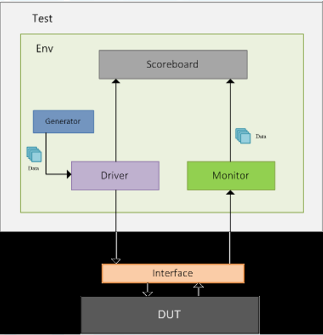
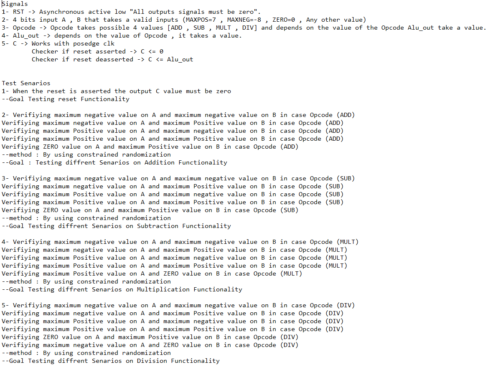
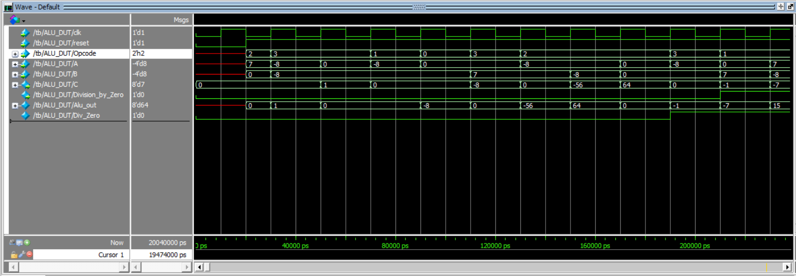
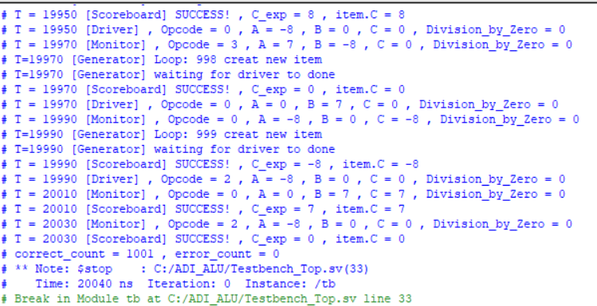

# Introduction Testbench
## Testbench Components
**Generator :**

- Generates different input stimulus to be driven to DUT

**Interface :**

- contains design signals that can be driven or monitored
- interface allows the verification components to access the DUT signals using a virtual interface handle

**Driver :**

- Drives the generated stimulus to the design
- the Driver is responsible for driving transactions to the DUT 
- It takes a transaction from mailbox and drive it to DUT interface

**Monitor :**

- Monitor the design input-output ports to capture design activity
- the Monitor has a virtual interface handle which monitors the events happens on the interface 
- It sees new transactions and then captures the information into a packet and sends it to scoreboard

**Scoreboard :**

- Checks the output from the design with expected behaviour
- The scoreboard is responsible to check the data integrity 

**Environment :**

- Contains all verification components mentioned above
- the environment is a container object simply to hold all verification components

**Test :**

- Contains the environment that can be tweaked with diffrent configuration settings

*Figure 1: Testbench Components*

# Design 

We use an ALU design that supports 4 main operations :
- ADD
- SUB
- MULT
- DIV

and make the files of testbench to test on this design

## Inputs  
**Opereand A** : 4 bits input. 
**Opereand B** : 4 bits input. 
**Opcode** : 2 bits input. 
**clk** : 1 bit input. 
**reset** : 1 bit input. 

---
## Outputs  
**C** : 8 bits output. 

---
## Verification Plan

In my verification plan iam intersted in covering all the corner values as MAXPOS and MAXNEG and ZERO values on A , B so make constrained randomization on A , B to take these values in sequencer file

*Figure 2: Verification_Plan*

---
## Verification Environment

During verification, I focused on implementing a class-based environment consisting of several elements such as the sequencer, driver, interface, DUT, monitor, and scoreboard. These components offer features like scalability, maintainability, and reusability, primarily relying on object-oriented programming (OOP) principles.

Our test cases focus mainly on testing system features with different operands , coverage were not included since our primary objective was to establish a class-based environment. Additional features can be extended later.

## Simulation
**Snippet from wave :**

*Figure 3: wave*

as sown from the wave that ALU makes its function (ADD , SUB , MULT , DIV) correctly

*Figure 4: output*

as sown from the output from my testbench

